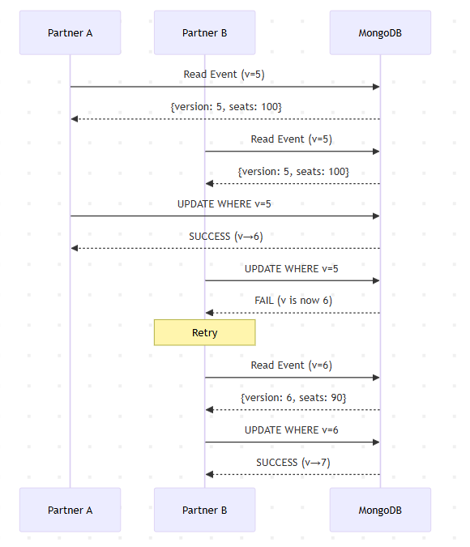
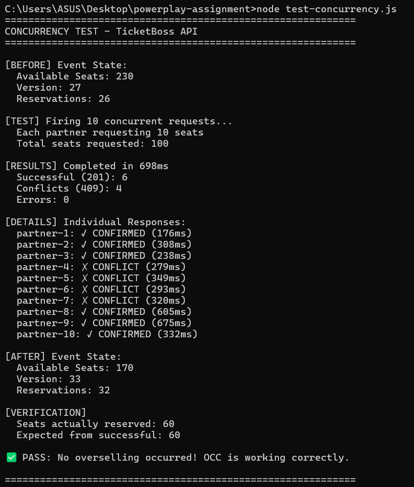
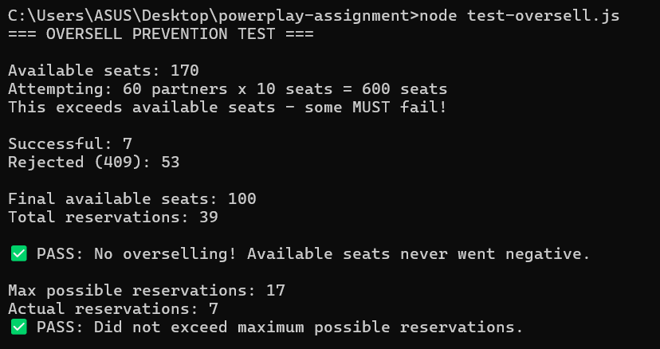

# TicketBoss

A RESTful API for event ticket reservations with optimistic concurrency control. Built to handle real-time seat reservations without overselling.

## Problem Statement

Build an event-ticketing API that allows external partners to reserve seats for a tech meet-up with 500 seats. The system must:

- Prevent overselling (no negative seat counts)
- Provide instant accept/deny responses (no queued processing)
- Handle concurrent reservation requests safely

## Tech Stack

- **Runtime**: Node.js
- **Framework**: Express.js
- **Database**: MongoDB with Mongoose ODM
- **Concurrency Control**: Optimistic locking with version field

## Project Structure

```
ticketboss/
├── src/
│   ├── config/
│   │   └── database.js          # MongoDB connection
│   ├── controllers/
│   │   └── reservationController.js  # Business logic
│   ├── middleware/
│   │   ├── errorHandler.js      # Global error handling
│   │   └── validateReservation.js    # Input validation
│   ├── models/
│   │   ├── Event.js             # Event schema
│   │   ├── Reservation.js       # Reservation schema
│   │   └── index.js
│   ├── routes/
│   │   └── reservations.js      # Route definitions
│   ├── utils/
│   │   └── seedDatabase.js      # Initial data seeding
│   └── app.js                   # Application entry point
├── .env.example
├── .gitignore
├── package.json
└── README.md
```

## Setup Instructions

### Prerequisites

- Node.js (v18 or higher)
- MongoDB (local installation or Docker)

### 1. Clone the Repository

```bash
git clone https://github.com/sehajmakkar/powerplay-assignment.git
```

### 2. Install Dependencies

```bash
npm install
```

### 3. Configure Environment

Create a `.env` file in the project root:

```env
PORT=3000
MONGODB_URI=mongodb://localhost:27017/ticketboss
```

### 4. Start MongoDB

Choose one of the following options:

**Option A: Local MongoDB**

```bash
mongod
```

**Option B: MongoDB Atlas (Cloud)**

1. Create a free cluster at [MongoDB Atlas](https://www.mongodb.com/atlas)
2. Get your connection string and update `.env`:

```env
MONGODB_URI=mongodb+srv://<username>:<password>@<cluster>.mongodb.net/ticketboss
```

> Note: Replace `<username>`, `<password>`, and `<cluster>` with your Atlas credentials.

### 5. Run the Application

**Development mode (with auto-reload):**

```bash
npm run dev
```

The server will start at `http://localhost:3000`

### 6. Verify Setup

```bash
curl http://localhost:3000/health
```

Expected response:

```json
{
  "status": "ok",
  "timestamp": "2025-01-15T10:30:00.000Z"
}
```

## Technical Decisions

### Why Optimistic Concurrency Control (OCC)?

The main challenge is preventing race conditions when multiple partners try to reserve seats simultaneously. I considered two approaches:

**Pessimistic Locking**: Lock the record before reading, preventing others from accessing it until the transaction completes.

**Optimistic Locking**: Allow concurrent reads, but check for conflicts at write time using a version field.

I chose OCC because:

1. **Better performance**: No blocking means faster response times
2. **Scalability**: Works well with high concurrency
3. **User experience**: Partners get instant responses


### How OCC Works in This Project

1. Each event document has a `version` field (starts at 0)
2. When reserving seats:
   - Read current version (e.g., version = 5)
   - Attempt atomic update with condition: `WHERE version = 5`
   - If version matches: update succeeds, increment version to 6
   - If version changed: another request got there first, retry
3. Retry up to 3 times before returning 409 Conflict

```javascript
// Simplified OCC implementation
const updatedEvent = await Event.findOneAndUpdate(
  {
    eventId: "node-meetup-2025",
    availableSeats: { $gte: seats },
    version: currentVersion, // Version check
  },
  {
    $inc: {
      availableSeats: -seats,
      version: 1,
    },
  },
  { new: true }
);
```



### Why MongoDB?

1. **Document model**: Natural fit for events with varying attributes
2. **Atomic operations**: `findOneAndUpdate` provides atomicity needed for OCC
3. **Scalability**: Horizontal scaling for production workloads
4. **Familiarity**: Aligns with the team's tech stack

### Database Schema Design

**Event Collection**

| Field          | Type   | Purpose                     |
| -------------- | ------ | --------------------------- |
| eventId        | String | Unique identifier (indexed) |
| name           | String | Event name                  |
| totalSeats     | Number | Total capacity              |
| availableSeats | Number | Current availability        |
| version        | Number | OCC version field           |

**Reservation Collection**

| Field         | Type   | Purpose                      |
| ------------- | ------ | ---------------------------- |
| reservationId | String | UUID (indexed)               |
| eventId       | String | Reference to event (indexed) |
| partnerId     | String | Partner identifier (indexed) |
| seats         | Number | Number of seats (1-10)       |
| status        | String | "confirmed" or "cancelled"   |

### Validation Strategy

Input validation happens at two levels:

1. **Middleware layer**: Validates request format before controller
2. **Schema layer**: Mongoose enforces constraints (min/max seats, enums)

This separation keeps controllers focused on business logic.

### Error Handling

The API uses a global error handler that:

- Catches Mongoose validation errors
- Handles malformed JSON
- Returns consistent error response format
- Never exposes internal error details to clients

## Assumptions

1. **Single event**: The API is scoped to one event (node-meetup-2025). Could be extended to support multiple events.

2. **No authentication**: Partners are identified by `partnerId` but not authenticated. In production, this would need API keys or OAuth.

3. **Seats are fungible**: No specific seat selection - just quantity. Suitable for general admission events.

4. **Cancellation returns all seats**: Partial cancellation is not supported.

5. **3 retry limit**: OCC retries are capped at 3 to prevent infinite loops under extreme contention.

## API Documentation

### Base URL

```
http://localhost:3000
```

### Endpoints Overview

| Method | Endpoint                       | Description        |
| ------ | ------------------------------ | ------------------ |
| GET    | `/reservations`                | Get event summary  |
| POST   | `/reservations`                | Reserve seats      |
| DELETE | `/reservations/:reservationId` | Cancel reservation |
| GET    | `/health`                      | Health check       |

---

### 1. Get Event Summary

Returns current event status including available seats and reservation count.

**Request**

```
GET /reservations
```

**Response (200 OK)**

```json
{
  "eventId": "node-meetup-2025",
  "name": "Node.js Meet-up",
  "totalSeats": 500,
  "availableSeats": 485,
  "reservationCount": 3,
  "version": 3
}
```

---

### 2. Reserve Seats

Create a new reservation for a partner.

**Request**

```
POST /reservations
Content-Type: application/json
```

```json
{
  "partnerId": "abc-corp",
  "seats": 3
}
```

**Parameters**

| Field     | Type    | Required | Constraints      |
| --------- | ------- | -------- | ---------------- |
| partnerId | string  | Yes      | Non-empty string |
| seats     | integer | Yes      | 1-10 (inclusive) |

**Response (201 Created)**

```json
{
  "reservationId": "550e8400-e29b-41d4-a716-446655440000",
  "seats": 3,
  "status": "confirmed"
}
```

**Error Responses**

| Status | Condition        | Response                                      |
| ------ | ---------------- | --------------------------------------------- |
| 400    | Invalid input    | `{"error": "seats must be between 1 and 10"}` |
| 400    | Missing field    | `{"error": "partnerId is required"}`          |
| 409    | Not enough seats | `{"error": "Not enough seats left"}`          |

---

### 3. Cancel Reservation

Cancel an existing reservation and return seats to the pool.

**Request**

```
DELETE /reservations/:reservationId
```

**Response (204 No Content)**

Empty response body on success.

**Error Responses**

| Status | Condition         | Response                                     |
| ------ | ----------------- | -------------------------------------------- |
| 404    | Not found         | `{"error": "Reservation not found"}`         |
| 404    | Already cancelled | `{"error": "Reservation already cancelled"}` |

---

### 4. Health Check

**Request**

```
GET /health
```

**Response (200 OK)**

```json
{
  "status": "ok",
  "timestamp": "2025-01-15T10:30:00.000Z"
}
```

---

## Testing

### Manual Testing with cURL

```bash
# Get event summary
curl http://localhost:3000/reservations

# Reserve 3 seats
curl -X POST http://localhost:3000/reservations \
  -H "Content-Type: application/json" \
  -d '{"partnerId": "abc-corp", "seats": 3}'

# Cancel reservation
curl -X DELETE http://localhost:3000/reservations/{reservationId}
```

### Concurrency Testing

A test script is included to verify OCC works correctly:

```bash
node test-concurrency.js
```

This fires 10 simultaneous requests and verifies:

- No overselling occurred
- Seat counts are consistent
- Version increments correctly





## Future Improvements

If this were a production system, I would add:

- [ ] Authentication (API keys for partners)
- [ ] Rate limiting per partner
- [ ] Multiple event support
- [ ] Reservation expiry (auto-cancel after timeout)
- [ ] Webhook notifications for reservation status
- [ ] Unit and integration tests with Jest
- [ ] Docker containerization
- [ ] API versioning (v1/reservations)
- [ ] Request logging and monitoring

## Author

Built as part of a coding assignment for Powerplay.
